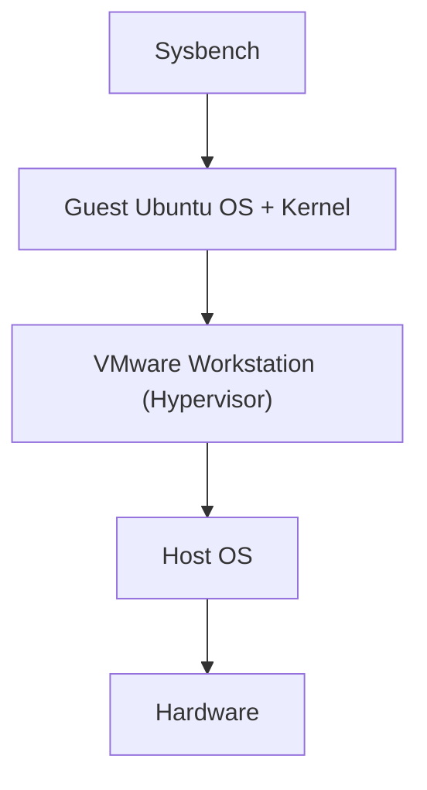
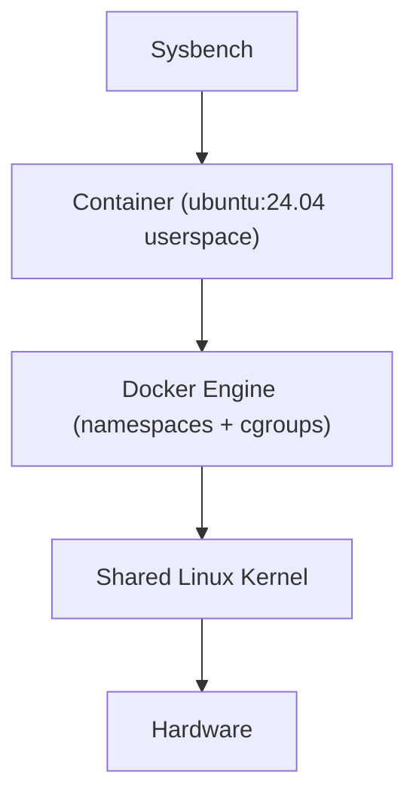
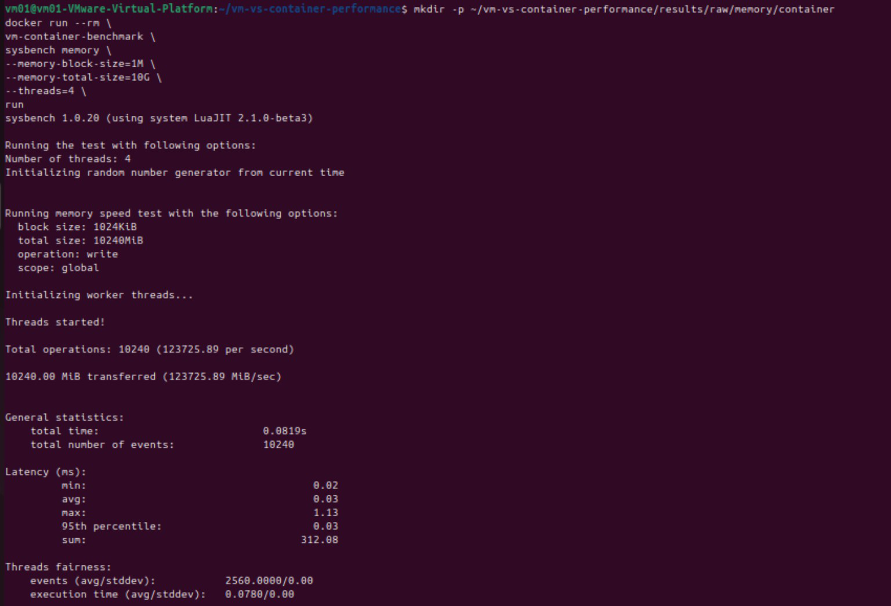
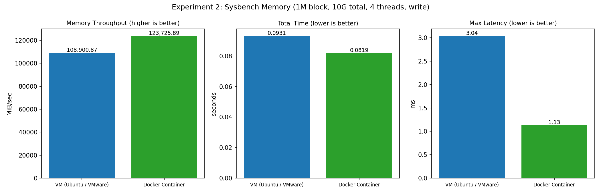

# Experiment 2  Memory Performance: Virtual Machine vs Docker Container

[](#)
[](#)
[](#)
[](#)

---

## Executive Summary

This experiment compares memory-operation performance of an **Ubuntu Virtual Machine (VMware Workstation)** and a **Docker container** (`vm-container-benchmark`, based on `ubuntu:24.04`) using the identical Sysbench memory workload (1 MiB blocks, 10 GiB total, 4 threads, write).

### Key Finding

> **The Docker container reached 123,725.89 MiB/sec versus 108,900.87 MiB/sec for the VM – a +13.61% throughput advantage – and a maximum latency of 1.13 ms versus 3.04 ms (-62.8%).**

---

## Table of Contents

1. [Objectives](#1-objectives)
2. [VM vs Container Architecture](#2-vm-vs-container-architecture)
3. [Environment Specifications](#3-environment-specifications)
4. [Experimental Procedure](#4-experimental-procedure)
5. [Empirical Results & Screenshots](#5-empirical-results--screenshots)
6. [Performance Comparison Table](#6-performance-comparison-table)
7. [Metric Explanations & Visualization](#7-metric-explanations--visualization)
8. [Technical Analysis & Discussion](#8-technical-analysis--discussion)
9. [Limitations](#9-limitations)
10. [Conclusion](#10-conclusion)
11. [Repository Structure & Reproduction](#11-repository-structure--reproduction)

---

## 1. Objectives

1. **Environment setup** – Prepare an Ubuntu VM and a Docker benchmark image with the same tooling (`sysbench 1.0.20`).
2. **Controlled workload** – Run an identical Sysbench memory test in both environments.
3. **Metric collection** – Record operations/sec, MiB/sec transfer rate, total time and latency (min, avg, max, 95th percentile).
4. **Evaluation** – Compare the overhead of full hardware virtualization (VM) with OS-level virtualization (container) for memory-bound work.

---

## 2. VM vs Container Architecture

A **VM** boots its own guest kernel on top of a hypervisor; a **container** is an isolated process group (namespaces + cgroups) that shares the host kernel.

**Virtual Machine**



**Docker Container**



```
   VM                                   Container
+--------------------------+         +--------------------------+
| Sysbench                 |         | Sysbench                 |
| Guest OS (own kernel)    |         | Container userspace      |
| Hypervisor (VMware)      |         | Docker Engine            |
| Host OS                  |         | Host OS / Linux kernel   |
| Hardware                 |         | Hardware                 |
+--------------------------+         +--------------------------+
```

| Aspect | Virtual Machine | Container |
|---|---|---|
| Isolation | Hardware-level (separate kernel) | Process-level (shared kernel) |
| Startup | Seconds–minutes | Milliseconds–seconds |
| Memory overhead | Full guest OS RAM | Only app + libraries |
| Memory access path | Guest → hypervisor (EPT/NPT) → host | Direct host kernel memory management |

---

## 3. Environment Specifications

| Parameter | VM | Docker Container |
|---|---|---|
| Platform | Ubuntu on VMware Workstation (`vm01-VMware-Virtual-Platform`) | Docker on the same Ubuntu VM |
| Base OS | Ubuntu 24.04 LTS | `ubuntu:24.04` image |
| Benchmark tool | Sysbench 1.0.20 (LuaJIT 2.1.0-beta3) | Sysbench 1.0.20 (LuaJIT 2.1.0-beta3) |
| Threads | 4 | 4 |
| Memory block size | 1 MiB | 1 MiB |
| Total memory transferred | 10 GiB | 10 GiB |
| Operation / scope | write / global | write / global |

> The lab manual recommends a controlled configuration (4 vCPU, 8 GB RAM, 60 GB disk; container limits `--cpus=4 --memory=8g`). Verify with `nproc`, `free -h` and `lsblk`, and record the actual values in `docs/`.

---

## 4. Experimental Procedure

### Step 1: Record the environment

```bash
cd ~/vm-vs-container-performance
mkdir -p docs results/raw results/processed results/figures scripts workloads
lscpu   > docs/cpu-info.txt
free -h > docs/memory-info.txt
lsblk   > docs/storage-info.txt
uname -a > docs/kernel-info.txt
docker --version
```

### Step 2: Install tools inside the VM

```bash
sudo apt update && sudo apt upgrade -y
sudo apt install -y sysbench fio iperf3 htop sysstat python3 python3-pip git
sysbench --version
nproc && free -h
```

### Step 3: Build the benchmark container image

Dockerfile ([`docker/Dockerfile`](docker/Dockerfile)):

```dockerfile
FROM ubuntu:24.04
RUN apt-get update && \
    apt-get install -y sysbench fio iperf3 python3 python3-pip procps sysstat && \
    rm -rf /var/lib/apt/lists/*
WORKDIR /benchmark
```

```bash
docker build -t vm-container-benchmark -f docker/Dockerfile .
docker images
```

### Step 4: Run the memory benchmark

**VM**
```bash
mkdir -p ~/vm-vs-container-performance/results/raw/memory/vm
sysbench memory --memory-block-size=1M --memory-total-size=10G --threads=4 run
```

**Docker container** (same workload; add `--cpus=4 --memory=8g` for strict resource parity)
```bash
mkdir -p ~/vm-vs-container-performance/results/raw/memory/container
docker run --rm vm-container-benchmark \
  sysbench memory --memory-block-size=1M --memory-total-size=10G --threads=4 run
```

### Step 5: Monitor resource usage (second terminal)

```bash
htop            # or: vmstat 1
docker stats    # container CPU / memory / IO
```

### Step 6: Repeat and store results
[`scripts/benchmark.sh`](scripts/benchmark.sh) repeats each test 10 times into `results/raw/memory/{vm,container}/run_N.txt`; [`scripts/parse_sysbench.py`](scripts/parse_sysbench.py) computes mean ± stddev.

### Step 7: Publish to GitHub

```bash
git status
git add .
git commit -m "Add memory benchmark"
git push
```

---

## 5. Empirical Results & Screenshots

### VM – Sysbench memory


*Figure 1: VM memory benchmark (108,900.87 MiB/sec).*

### Docker container – Sysbench memory



*Figure 2: Docker container memory benchmark (123,725.89 MiB/sec).*

---

## 6. Performance Comparison Table

| Performance Metric | VM | Docker Container | Delta | Better |
| :--- | :---: | :---: | :---: | :---: |
| Block size / total size | 1 MiB / 10 GiB | 1 MiB / 10 GiB | Matched | Identical workload |
| Threads | 4 | 4 | Matched | Identical |
| **Total operations** | 10,240 | 10,240 | 0 | Same |
| **Operations/sec** | 108,900.87 | **123,725.89** | **+14,825.02 (+13.61%)** | **Container** |
| **Transfer rate (MiB/sec)** | 108,900.87 | **123,725.89** | **+13.61%** | **Container** |
| **Total time** | 0.0931 s | **0.0819 s** | -0.0112 s (-12.03%) | **Container** |
| **Min latency** | 0.02 ms | 0.02 ms | 0 | Equal |
| **Avg latency** | 0.03 ms | 0.03 ms | 0 | Equal |
| **95th percentile latency** | 0.03 ms | 0.03 ms | 0 | Equal |
| **Max latency** | 3.04 ms | **1.13 ms** | -1.91 ms (-62.83%) | **Container** |
| **Latency sum** | 341.60 ms | **312.08 ms** | -29.52 ms (-8.64%) | **Container** |
| Events/thread (avg/stddev) | 2560 / 0.00 | 2560 / 0.00 | Matched | Fair thread split |
| Execution time (avg/stddev) | 0.0854 / 0.01 s | 0.0780 / 0.00 s | -8.67% | **Container** |

---

## 7. Metric Explanations & Visualization

1. **Operations/sec** – memory block operations completed per second (each op = one 1 MiB block). **Higher is better.**
2. **Transfer rate (MiB/sec)** – data moved per second; equals ops/sec here because the block size is 1 MiB. **Higher is better.**
3. **Total time** – wall-clock duration of the 10 GiB transfer. **Lower is better.**
4. **Latency (ms)** – time per memory operation: min, average, 95th percentile (consistency) and max (worst-case spike).
5. **Thread fairness** – events/execution time per thread; stddev 0.00 means the work was evenly distributed.



*Figure 3: Throughput, total time and max latency comparison (generated by [`scripts/generate_plots.py`](scripts/generate_plots.py)).*

---

## 8. Technical Analysis & Discussion

### 1. Memory access path
- A **VM** translates guest-virtual → guest-physical → host-physical addresses (nested paging, EPT/NPT), and VMware Workstation additionally runs on a host OS. Each extra translation level costs time on TLB misses.
- A **container** uses the host kernel's own memory management, so Sysbench's writes go through a single page-table translation.

### 2. Latency spikes
- Average and 95th-percentile latency are identical (0.03 ms) – steady-state memory writes cost the same in both.
- The VM's max latency (3.04 ms) is higher; worst-case events are affected by hypervisor scheduling and host-OS interference, while the container recorded only 1.13 ms.

### 3. Resource overhead
- A VM reserves RAM for a full guest OS; the container carries only the process and its libraries, leaving more memory for the workload.

---

## 9. Limitations

- Each environment is represented by **one captured run**; the lab manual specifies **10 repetitions** for statistically robust results. Run `scripts/benchmark.sh` and `scripts/parse_sysbench.py` to obtain mean ± stddev.
- The container ran inside the same VM, so both environments share the underlying VMware layer; the comparison isolates container vs. guest-process overhead, not bare-metal behaviour.
- The write-only operation was tested; read operations (`--memory-oper=read`) were not captured.

---

## 10. Conclusion

1. **Throughput**: The container delivered **+13.61% higher** memory throughput than the VM.
2. **Consistency**: Average and 95th-percentile latency matched (0.03 ms), but the container had a **62.8% lower worst-case latency**.
3. **Recommendation**: Containers suit lightweight, memory-intensive, fast-scaling workloads (microservices, CI, batch jobs); VMs remain preferable where strong kernel-level isolation or different guest OSes are required.

---

## 11. Reproduction

### How to Reproduce

```bash
docker build -t vm-container-benchmark -f docker/Dockerfile .
chmod +x scripts/benchmark.sh && ./scripts/benchmark.sh
python3 scripts/parse_sysbench.py
python3 scripts/generate_plots.py
```

---
*Laboratory Experiment conducted for Cloud Computing Course. Reference: Performance Analysis of Virtual Machines and Containers – Lab Manual.*
